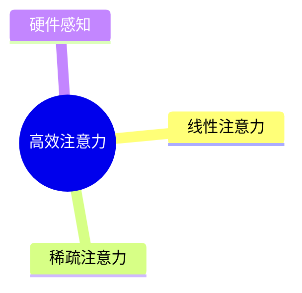

# 📚 Personal Knowledge Management (PKM) Agent

> 一个生产级、可自托管的「AI 个人知识管理助手」。它会自动抓取你关心的网页、PDF、YouTube、微信公众号、邮件、Notion、RSS，自动生成摘要、标签、双链、思维导图，写入你的 Obsidian 仓库；同时支持 **向量搜索 + 长期记忆 + 自然语言对话**，并定期自动产出 **每周 / 每月知识回顾**。

[](https://www.python.org/) [](https://fastapi.tiangolo.com/) [](https://langchain-ai.github.io/langgraph/) [](https://www.trychroma.com/) [](LICENSE)

---

## ✨ 功能亮点

- 🌐 **多源抓取**：网页 (Playwright) · PDF · YouTube 字幕 · 微信公众号 · IMAP 邮件 · Notion · RSS
- 🧠 **智能流水线**（LangGraph 编排）：抓取 → 摘要 → 标签 → 关联推荐 → 思维导图 → 入库
- 🗂️ **Obsidian 双向同步**：自动写入 Inbox / Daily / Reviews 文件夹，含 YAML frontmatter、`[[wikilinks]]`、Mermaid mindmap
- 🔎 **混合检索**：Chroma 向量搜索 + 本地关键词搜索 + 元数据过滤
- 💬 **自然语言对话**：检索增强 (RAG) 的中文助手，支持长期记忆、引用回答；可选 **查询改写**（LLM 扩写多路子查询，提高召回）与 **上下文压缩**（超长历史自动摘要，避免上下文溢出）
- 🕸️ **知识图谱可视化**：`/graph` 交互式 D3.js 力导向图，按标签 / 双链 / 向量相似度三类边渲染，拖拽、缩放、点击查看节点详情
- 🗓️ **定时自动 Review**：APScheduler 驱动，每周日 / 每月最后一天自动生成回顾报告
- 🛠️ **生产级工程**：完整类型提示、`loguru` 日志、`tenacity` 重试、Docker、CI/CD、Pytest 335 个测试 99% 覆盖率

---

## 🏗️ 架构总览

```
┌────────────────────────┐    ┌──────────────────────────┐
│  Web 面板 / CLI / REST │ ─→ │       PKMAgent           │
└────────────────────────┘    │  (agents/pkm_agent.py)   │
                              └────────────┬─────────────┘
                                           │
                ┌──────────────────────────┼──────────────────────────┐
                ▼                          ▼                          ▼
        ┌───────────────┐         ┌───────────────────┐       ┌──────────────────┐
        │ Ingest Graph  │         │   Chat Graph      │       │  Review Graph    │
        │  (LangGraph)  │         │  retrieval + LLM  │       │ collect+summarise│
        └───────┬───────┘         └─────────┬─────────┘       └─────────┬────────┘
                │                           │                           │
                ▼                           ▼                           ▼
        Scrapers · Summariser · Tagger · Linker · Mindmap · VectorStore · Obsidian Vault
                          │                              │
                          ▼                              ▼
                Chroma (本地向量库)             SQLite (元数据 / 历史)
```

---

## 🚀 快速开始（本地）

### 1. 克隆 & 安装

```bash
git clone https://github.com/<你的用户名>/Personal-Knowledge-Management-PKM-Agent.git
cd Personal-Knowledge-Management-PKM-Agent

python -m venv .venv && source .venv/bin/activate     # Windows: .venv\Scripts\activate
pip install -r requirements.txt

# 安装 Playwright 浏览器（首次抓取动态网页前必须执行）
python -m playwright install chromium
```

### 2. 配置 `.env`

```bash
cp .env.example .env
# 然后用编辑器修改下列关键变量：
#   LLM_PROVIDER=openai                      # 或 anthropic / ollama
#   OPENAI_API_KEY=sk-xxxxxxxx
#   OBSIDIAN_VAULT_PATH=/Users/yourname/Documents/MyVault
#   YOUTUBE_API_KEY=...                      # 可选
#   NOTION_API_KEY=...                       # 可选
```

### 3. 初始化 & 启动

```bash
# 初始化数据库
python main.py init-db

# 启动 Web 面板 + REST API（默认 http://localhost:8000）
python main.py serve
```

打开浏览器访问 `http://localhost:8000` 即可看到内置的搜索面板。
API 文档：`http://localhost:8000/docs`。

---

## 🐳 Docker 一键运行

### 单容器

```bash
cp .env.example .env   # 改好 OPENAI_API_KEY 与 OBSIDIAN_VAULT_PATH
docker compose up -d --build
docker compose logs -f pkm-agent
```

挂载说明：

| 主机路径                  | 容器路径    | 用途                       |
| ------------------------- | ----------- | -------------------------- |
| `./data`                  | `/app/data` | Chroma + SQLite + 上传文件 |
| `./logs`                  | `/app/logs` | 日志                       |
| `$OBSIDIAN_VAULT_PATH`    | `/app/vault`| 你的 Obsidian 仓库         |

### 完全本地（含 Ollama）

```bash
docker compose --profile ollama up -d --build
docker exec -it pkm-ollama ollama pull qwen2.5:7b
# .env 中设置 LLM_PROVIDER=ollama
```

---

## 💻 命令行用法（CLI）

```bash
# 摄入一个网页
python main.py ingest web https://lilianweng.github.io/posts/2023-06-23-agent/

# 摄入一个 YouTube 视频
python main.py ingest youtube https://www.youtube.com/watch?v=dQw4w9WgXcQ

# 摄入本地 PDF
python main.py ingest pdf ./papers/attention.pdf

# 关键词 / 语义搜索
python main.py search "transformer 的注意力机制"

# 与你的知识库对话
python main.py chat

# 立即生成本周回顾
python main.py review weekly

# 订阅 RSS（之后会被定时任务自动拉取）
python main.py rss-add https://hnrss.org/frontpage
```

---

## 🌐 REST API 速览

| Method | Path                    | 描述                                           |
| ------ | ----------------------- | ---------------------------------------------- |
| POST   | `/api/ingest`           | 摄入 URL（`source_type` + `url`）              |
| POST   | `/api/ingest/upload`    | 上传 PDF / DOCX / MD / TXT 并摄入              |
| POST   | `/api/search`           | 混合检索 (`{ "query":"…", "k":5 }`)            |
| POST   | `/api/chat`             | 对话（可启用 `rewrite_query` / `compress_history`） |
| POST   | `/api/review`           | 立即生成回顾 (`{ "period":"weekly" }`)         |
| GET    | `/api/graph`            | 知识图谱 JSON（scope / limit / tag / similarity） |
| GET    | `/graph`                | D3.js 力导向图前端面板                          |
| GET    | `/api/tasks`            | 查看所有定时任务                               |
| GET    | `/health`               | 健康检查                                       |

### 🕸️ 知识图谱

打开浏览器访问 `http://localhost:8000/graph` 即可看到交互式的知识图谱。

- **scope=all** — 展示全部知识（默认 limit=200）
- **scope=recent** — 仅最近 N 条
- **scope=tag&tag=ai** — 按标签过滤
- **三类边**：
  - 🔵 蓝色 = 共享标签（权重 = 共享标签数）
  - 🟠 橙色 = `[[wikilinks]]` 双链
  - 🟢 绿色 = 向量相似度（`?include_similarity=true&similarity_threshold=0.75`）
- 节点大小 = 节点度数（连接数越多越大）
- 支持拖拽 / 缩放 / 点击查看节点详情

### 🧠 RAG 优化（查询改写 + 上下文压缩）

`/api/chat` 内置两项可选 RAG 增强，默认关闭，按需启用：

```json
POST /api/chat
{
  "message": "Transformer 在多模态任务里有哪些扩展？",
  "history": [...],
  "rewrite_query": true,
  "compress_history": true,
  "history_token_budget": 1200,
  "max_subqueries": 3
}
```

- **rewrite_query** — 调用 LLM 将原问题扩写为 `max_subqueries` 条互补的中文检索短句，对每条子查询分别走 hybrid_search，最后做去重合并。适合「指代不清」或「多跳」问题，召回率显著提升。响应中通过 `subqueries` 回传实际使用的子查询列表，便于调试。
- **compress_history** — 当对话历史 token 数超过 `history_token_budget`（CJK-aware 近似计数）时，把早期消息整合为一条 `system: previously: …` 的摘要消息，仅保留最近 4 轮原文。响应中通过 `compressed_history_summary` 回传压缩摘要。LLM 调用失败时自动降级为「直接截断」，保证对话不中断。

两项功能都实现了「优雅降级」：任何 LLM 故障都会回退到原始问题 / 截断历史，永远不会让 `/api/chat` 报 500。

实现位于 `tools/rag_pipeline.py`，由 `workflows/chat_workflow.py` 的 LangGraph 3-节点链路 (`compress_node → retrieve → answer_node`) 串联。

---

## 🔁 Obsidian 同步教程

PKM Agent 把 Obsidian Vault 当作 **"权威源" + "展示层"**。所有 AI 处理都会落到 Vault 中的 Markdown 文件，你在 Obsidian 内的修改也会被下次扫描时识别。

### 一、初始化

1. 打开 Obsidian，新建（或选择）一个 Vault，例如 `~/Documents/MyVault`。
2. 在 PKM Agent 的 `.env` 中设置：

   ```env
   OBSIDIAN_VAULT_PATH=/Users/yourname/Documents/MyVault
   OBSIDIAN_INBOX_FOLDER=PKM/Inbox
   OBSIDIAN_DAILY_FOLDER=PKM/Daily
   OBSIDIAN_REVIEW_FOLDER=PKM/Reviews
   ```

3. 启动服务后，Agent 会在 Vault 内自动创建上述目录。

### 二、生成的 Markdown 结构

```markdown
---
title: 高效注意力机制综述
type: web
source: https://example.com/article
tags: [注意力机制, transformer, 综述]
related: ["FlashAttention 2 论文笔记", "Sparse Attention 总览"]
ingested_at: 2026-05-29T10:00:00
---

# 高效注意力机制综述

> 来源: [web](https://example.com/article)

## ✨ 智能摘要
- TL;DR …
- 关键知识点 …

## 🧠 思维导图


## 🔗 相关笔记
- [[FlashAttention 2 论文笔记]]
- [[Sparse Attention 总览]]

## 📝 原始正文（节选）
…
```

### 三、双向同步建议

- 在 Obsidian 内修改笔记 → 直接保存即可，下次定时任务会重新读取。
- 想强制重新索引：删除对应笔记 → 在 PKM Agent 中再次 `ingest` 即可。
- **多设备同步**：把 Vault 放进 iCloud / OneDrive / Syncthing 等同步盘，PKM Agent 与 Obsidian 共用同一目录即可。

---

## 🎯 真实使用案例（推荐玩法）

### 案例 1：把 YouTube 演讲变成可搜索笔记

```bash
python main.py ingest youtube https://www.youtube.com/watch?v=ZP-OHk1HD9M
python main.py search "Andrej Karpathy 关于 LLM 训练的关键观察"
```

→ Agent 拉取字幕 → 生成 4 段式摘要（TL;DR / 关键点 / 延伸思考 / 行动项）→ 自动加入 `transformer` `LLM` `Karpathy` 等标签 → 在 Obsidian Inbox 形成笔记，并双链到你之前的相关笔记。

### 案例 2：把每周阅读列表打包成一份「学习周报」

```bash
# 1. 抓取一批文章
for url in $(cat reading_list.txt); do
  python main.py ingest web "$url"
done

# 2. 立即生成本周 Review
python main.py review weekly
```

→ Review 文件出现在 `Vault/PKM/Reviews/Weekly Review 2026-05-22 ~ 2026-05-29.md`，包含主题聚类、空白点和 3 条行动计划。

### 案例 3：用自然语言查找"昨天看过什么"

打开 Web 面板，在对话框输入：

> 帮我总结昨天看的那篇关于 Sparse Attention 的论文，并对比一下我之前关于 FlashAttention 的笔记。

PKM Agent 会：
1. 通过混合搜索定位到昨天那篇笔记 + 之前的 FlashAttention 笔记。
2. 用 LLM 比较二者优缺点。
3. 给出可点击的 `[[wikilink]]` 引用，方便回到 Obsidian 原文。

---

## 🗓️ 每周自动 Review 指南

定时任务由 APScheduler 提供，默认配置（可在 `.env` 中修改）：

```env
WEEKLY_REVIEW_CRON=0 20 * * 0        # 每周日 20:00
MONTHLY_REVIEW_CRON=0 21 28-31 * *   # 每月最后一天 21:00
RSS_FETCH_INTERVAL_MIN=60            # 每 60 分钟拉一次订阅 RSS
```

工作流程：

1. 服务启动时，`api/server.py` 中的 `lifespan()` 会注册以上 cron。
2. 触发后，`workflows/review_workflow.py` 自动收集本周期内 SQLite 中所有新增的 `Knowledge` 条目。
3. 用 LLM 生成 4 段式回顾报告（亮点 / 主题聚类 / 延伸阅读 / 行动计划）。
4. 写入 `OBSIDIAN_REVIEW_FOLDER`，同时存入 `review_reports` 表。
5. 你可以通过 `GET /api/tasks` 或 Web 面板查看任务下次运行时间。

手动触发：

```bash
python main.py review weekly
python main.py review monthly
```

---

## 🧪 运行测试

```bash
pytest -q
```

CI（GitHub Actions）会在每次 push / PR 时自动跑测试，并在 push 到 `main` 分支或打 tag 时构建并发布 Docker 镜像到 GHCR。

---

## 📂 项目结构

```
Personal-Knowledge-Management-PKM-Agent/
├── main.py                    # CLI / 启动入口
├── requirements.txt
├── pyproject.toml
├── pytest.ini
├── Dockerfile
├── docker-compose.yml
├── .env.example
├── .gitignore
├── init_github.sh             # 一键 git init + gh repo create + push
├── .github/workflows/ci-cd.yml
│
├── core/                      # 配置 / LLM / 向量 / Obsidian / 调度
│   ├── config.py
│   ├── llm.py
│   ├── vector_store.py
│   ├── obsidian.py
│   └── scheduler.py
├── models/                    # Pydantic schemas + SQLAlchemy models
│   ├── schemas.py
│   └── database.py
├── scrapers/                  # 多源抓取
│   ├── base.py
│   ├── web_scraper.py
│   ├── pdf_scraper.py
│   ├── youtube_scraper.py
│   ├── wechat_scraper.py
│   ├── email_scraper.py
│   ├── notion_scraper.py
│   └── rss_scraper.py
├── tools/                     # AI 工具：摘要 / 标签 / 关联 / 思维导图 / 搜索
│   ├── summarizer.py
│   ├── tagger.py
│   ├── linker.py
│   ├── mindmap.py
│   └── search.py
├── workflows/                 # LangGraph 编排
│   ├── ingest_workflow.py
│   ├── chat_workflow.py
│   └── review_workflow.py
├── agents/                    # 高层 Agent 编排
│   ├── pkm_agent.py
│   ├── chat_agent.py
│   └── review_agent.py
├── api/                       # FastAPI 服务
│   ├── server.py
│   ├── routes/{ingest,search,chat,review}.py
│   └── static/index.html
├── utils/                     # logger / retry / parsers
│   ├── logger.py
│   ├── retry.py
│   └── parsers.py
└── tests/
    ├── conftest.py
    ├── test_scrapers.py
    └── test_agents.py
```

---

## 🛡️ 故障排查 (FAQ)

- **`ModuleNotFoundError: playwright`**：执行 `pip install playwright && python -m playwright install chromium`。
- **YouTube 拉取字幕失败**：部分视频未提供字幕；可设置 `YOUTUBE_API_KEY` 至少拿到标题/描述。
- **微信公众号抓取被反爬**：使用桌面网络，关闭代理；必要时降低抓取频率。
- **Chroma 报错 `tenant not found`**：删除 `data/chroma` 重新启动即可。
- **Obsidian 没有看到新笔记**：检查 `.env` 中 `OBSIDIAN_VAULT_PATH` 是否指向真实存在的目录，且 PKM Agent 拥有写权限。

---

## 📜 License

MIT © 2026 Personal Knowledge Management Agent Maintainers
